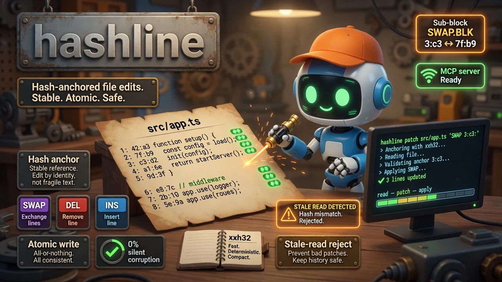

# hashline

<div align="center">
  
</div>

<div align="center">


</div>

**Hash-anchored file editing for Claude Code, AI coding agents, and patch-safe automation.**  
Every line gets a stable xxh32 hash (`42:a3`). Patch by anchor, not by fragile text match. Stale reads are caught and rejected before they corrupt your work.

<div align="center">

```bash
curl -fsSL "https://raw.githubusercontent.com/quangdang46/hashline/main/install.sh?$(date +%s)" | bash
```

</div>

---

## 🤖 Agent Quickstart (MCP / Robot Mode)

hashline ships a 6-tool MCP server that works with Claude Code, Codex, Cursor, Windsurf, Gemini CLI, and OpenCode. The installer auto-configures it.

```bash
# MCP stdio server (auto-wired by installer)
hashline mcp

# Read a file with hashes — agents copy anchors, not lines
hashline read src/auth.js

# Patch by anchor — survives nearby edits (compact output)
hashline patch src/auth.js 'SWAP 2:b2:
+  const decoded = jwt.verify(token, env.SECRET)'
# OK src/auth.js#7f2a edits=1 changed=1
# ~2:f9|  const decoded = jwt.verify(token, env.SECRET)

# Dry-run before applying
hashline patch src/auth.js 'DEL 3' --dry-run
```

**Output architecture** — agent-first, token-minimal by default:

| Mode | Flag | Description |
|------|------|-------------|
| **Compact** (default) | — | `OK path#hash edits=N changed=N` + changed lines only |
| **Verbose** | `--verbose` | Full file dump after mutation (human-readable) |
| **JSON** | `--json` | Structured JSON with changed lines array |

**Output conventions**
- stdout = data only (file content, patch result, JSON)
- stderr = diagnostics, warnings (`ERR KIND key=val` + `HINT ...` in compact mode)
- exit 0 = success, exit 1 = stale-read rejection or no-op

---

## TL;DR

### The Problem

AI coding agents (`str_replace`, `sed`, bespoke edit LLM tools) routinely botch file edits. The pattern is always the same: whitespace mismatch, stale context, a `}` that was supposed to close a block but grabbed the wrong one instead. Each failure costs 10–60 seconds in retry round-trips, and after the first successful edit, every remaining line number shifts — so targeting by number alone is fragile.

### The Solution

`hashline` replaces fragile text-matching with content-hashed line anchors (`42:a3`). Read a file once and every line comes with a stable xxh32 hash. Patch using those anchors — insertions, deletions, swaps, and block replacements all reference hashes, not line text or numbers. If the file changed between read and apply, hashline rejects the patch with a clear error. No silent corruption, no wasted retries.

### Why hashline?

| Feature | What it does |
|---------|--------------|
| **Agent-first output** | Compact, token-minimal by default — `OK path#hash edits=N` + changed lines only |
| **Stable anchors** | xxh32 hashes survive nearby edits; re-targeting is one anchor change |
| **Stale-read detection** | Hard error if file changed between read and patch |
| **Block-aware ops** | `SWAP.BLK` / `DEL.BLK` / `INS.BLK.POST` for brace-delimited, indent-based, and Ruby `def…end` blocks |
| **Atomic writes** | Temp file + rename. No partial writes, no torn edits |
| **Multi-op patches** | Several SWAP/DEL/INS in one pass via stdin pipe |
| **MCP server** | 6-tool stdio MCP for Claude Code, Codex, Cursor, and friends |
| **Daemon mode** | Background JSON-RPC over Unix socket or HTTP |
| **Dry-run preview** | `--dry-run` shows diff before applying |

### How hashline Compares

| Dimension | hashline | `str_replace` (built-in) | `sed` |
|-----------|----------|--------------------------|-------|
| **Stable anchors** | ✅ xxh32 hash `42:a3` | ❌ Exact text match | ❌ Fragile regex |
| **Stale-read detection** | ✅ Hard error on mismatch | ❌ Applies blindly | ❌ Applies blindly |
| **Block replacement** | ✅ SWAP.BLK / DEL.BLK / INS.BLK.POST | ❌ Line-granularity | ❌ Line-granularity |
| **Atomic writes** | ✅ Temp file + rename | ✅ Temp file + rename | ❌ In-place (torn writes possible) |
| **Multi-op batches** | ✅ stdin `*** Begin Patch` | ❌ One replacement per call | ✅ `-e` flag chaining |
| **Dry-run preview** | ✅ `--dry-run` with diff | ❌ Not supported | ❌ Not supported |
| **MCP server** | ✅ `hashline mcp` (6 tools) | N/A | N/A |
| **Setup** | Single Rust binary ~280 µs anchor resolution | Built into agent | POSIX standard | |

---

## Quick Example

```bash
# 1. Read a file — every line gets a hash
hashline read src/app.ts
# src/app.ts#1A2B
# 1:a1|import { verify } from 'jwt'
# 2:b2|const token = req.headers.authorization
# 3:c3|if (!verify(token, SECRET)) throw 401
# 4:d4|return decode(token)

# 2. Build a patch using the anchor (compact output)
hashline patch src/app.ts 'SWAP 3:c3:
+  if (!token) throw new AuthError("missing token")'
# OK src/app.ts#7f2a edits=1 changed=1
# ~3:e5|  if (!token) throw new AuthError("missing token")

# 3. Human-readable mode (full file after patch)
hashline patch src/app.ts --verbose 'SWAP 4:d4:
+  return decode(token)'

# 4. Structured JSON output
hashline patch src/app.ts --json 'SWAP 3:c3:
+  if (!token) throw new AuthError("missing token")'
```

---

## Design Philosophy

| Principle | Rationale |
|---|---|
| **Agent-first output** | Default output is compact, token-minimal, machine-readable. `--verbose` for human debugging. |
| **Anchors over content matching** | xxh32 hashes are stable, short, and easy for agents to copy. Re-targeting after an edit is a single anchor change. |
| **Stale-read is a hard error** | If the file changed between `read` and `patch`, `hashline` refuses — the agent must re-read and re-anchor. Better fail-fast than corrupt. |
| **Block awareness** | Brace-delimited, indentation-based, and Ruby `def…end` block ops eliminate the "find the closing brace" problem that LLMs struggle with. |
| **Atomic writes only** | Temp file + rename. No partial writes, no torn edits. |

## Limitation vs Alternatives

Why hashline is not a drop-in for `sed` or `str_replace`:

| Edge case | Reality |
|-----------|---------|
| **Text-search edits** | hashline does **not** support `sed s/old/new/g` — use `sed` when you need regex replacement across non-hashable text |
| **Line-number targeting** | hashline accepts line-number targets as fallback, but the design is anchor-first |
| **Interactive editing** | hashline is batch-oriented (read → patch) — for interactive editing use your editor |

---

## Credit

hashline is developed based on the idea of hash-anchored line editing. Thanks to [can1357](https://github.com/can1357) for the original [oh-my-pi](https://github.com/can1357/oh-my-pi).

---

## Installation

```bash
# macOS / Linux — curl pipe
curl -fsSL "https://raw.githubusercontent.com/quangdang46/hashline/main/install.sh?$(date +%s)" | bash

# Windows PowerShell
irm "https://raw.githubusercontent.com/quangdang46/hashline/main/install.ps1" | iex

# From source
cargo install --path crates/core
```

The installers auto-detect your platform, fetch the matching binary from GitHub Releases, verify the SHA-256, and atomically install to `~/.local/bin/hashline`. They also auto-detect supported MCP hosts (claude-code, codex, cursor, windsurf, vscode, gemini, opencode) and upsert a `hashline` MCP server entry for each.

After installing, `hashline update` upgrades in place from GitHub Releases with the same checksum verification. Once a day, interactive commands print a one-line notice to stderr when a newer release is available — disable it with `HASHLINE_NO_UPDATE_CHECK=1`.

---

## Agent Host Integrations

Beyond the MCP server, hashline ships thin-wrapper packages for agent hosts that
prefer **native read/edit tools** over MCP. Both shell out to the `hashline` binary —
they never reimplement hashing, staleness detection, or merge recovery in TypeScript.

| Package | Host | Tools | Install |
|---|---|---|---|
| [`integration/pi-hashline`](integration/pi-hashline) | pi-coding-agent | `read`, `edit`, `write`, `find_block`, `remove_file`, `rename_file` | `pi install npm:hashline-pi` |
| [`integration/opencode-plugin`](integration/opencode-plugin) | OpenCode | `hashline_read`, `hashline_edit`, `hashline_write`, `hashline_find_block`, `hashline_remove_file`, `hashline_rename_file` | `npm i hashline-opencode-plugin` + `opencode.json` `"plugin": ["hashline-opencode-plugin"]`, disable native `edit` |

### pi-coding-agent guide

The [`hashline-pi`](https://www.npmjs.com/package/hashline-pi) extension replaces pi's built-in
file tools with the full hashline surface — anchors on every read, stale-safe batched edits,
tree-sitter block ops, and colored diffs in the TUI.

```bash
# 1. Install the binary first (the package is a thin wrapper — it does not bundle it)
curl -fsSL "https://raw.githubusercontent.com/quangdang46/hashline/main/install.sh" | bash   # macOS / Linux
irm "https://raw.githubusercontent.com/quangdang46/hashline/main/install.ps1" | iex          # Windows (PowerShell)

# 2. Install the extension (project-local: add -l; global: omit it)
pi install npm:hashline-pi
```

Then `/reload` in pi and check `/hashline-status`. Requires binary >= 0.9.12.
Binary off PATH? Set `HASHLINE_BIN` or `{ "binary": "..." }` in `~/.pi/agent/hashline.json`.
Full details: [`integration/pi-hashline/README.md`](integration/pi-hashline/README.md).

### OpenCode

| Package | Install |
|---|---|
| [`integration/opencode-plugin`](integration/opencode-plugin) | `opencode.json` `plugin: ["@scope/hashline-opencode-plugin"]` + disable native `edit` |
See [`integration/opencode-plugin/README.md`](integration/opencode-plugin/README.md) — published as [`hashline-opencode-plugin`](https://www.npmjs.com/package/hashline-opencode-plugin) on npm.

Both packages require the `hashline` binary on `PATH` (or `HASHLINE_BIN`). See each package's
`README.md` and [`integration/CONTRACT.md`](integration/CONTRACT.md) for the exact CLI contract.

---

## Quick Start

```bash
# 1. Read a file with snapshot hashes
hashline read src/auth.js

# 2. Apply a single-line patch
hashline patch src/auth.js 'SWAP 2:
+  const decoded = jwt.verify(token, env.SECRET)'

# 3. Apply a range
hashline patch src/auth.js 'SWAP 2..4:
+  return decoded'

# 4. Delete a line
hashline patch src/auth.js 'DEL 3'

# 5. Dry-run first
hashline patch src/auth.js 'DEL 3' --dry-run

# 6. Block operations
hashline patch src/mod.rs 'SWAP.BLK 12:
+fn replaced() {
+    // new body
+}'

# 7. Multi-op via stdin (no intermediate file)
hashline patch src/auth.js - <<'EOF'
*** Begin Patch
SWAP 5:1a2b:
+  const decoded = jwt.verify(token, env.SECRET)
DEL 9
*** End Patch
EOF
```

---

## Commands

| Command | Description | See also |
|---|---|---|
| `read` | Read file with `[path#HASH]` + `LINE:hash|content` | `hashline guide` |
| `patch` | Apply SWAP/DEL/INS/BLK edits | `hashline guide` → _Patch Operations_ |
| `write` | Write content to a new file (`--force` overwrites) | |
| `find-block` | Find enclosing brace/indent/Ruby block around anchor | |
| `remove` | Delete a file | |
| `rename` | Rename (move) a file | |
| `remove` | Delete a file | |
| `guide` | Interactive user guide — always matches your binary | built-in |
| `serve` | daemon over Unix socket or HTTP | `hashline guide` → _Daemon Mode_ |
| `mcp` | MCP stdio server (6 tools) | `hashline guide` → _MCP Mode_ |
| `update` | Self-update the binary from GitHub Releases (SHA-256 verified) | `hashline update --check` |

---

## Architecture

```
┌─────────────────────────────┐
│ 1. hashline read            │
│    [file#1A2B]              │
│    1:a1|content             │
└──────────────┬──────────────┘
               │ copy anchor
               ▼
┌─────────────────────────────┐
│ 2. Build patch string       │
│    SWAP 2:b2:               │
│    + new content            │
└──────────────┬──────────────┘
               │
               ▼
┌─────────────────────────────┐        ┌──────────────┐
│ 3. hashline patch file      ├───────>│ --dry-run    │
│    (stdin for multi-op)     │        │ preview only │
└──────────────┬──────────────┘        └──────────────┘
               │ apply
               ▼
┌─────────────────────────────┐
│ 4. File updated             │
│    (atomic write)           │
└─────────────────────────────┘
```

Block-aware resolution by extension:
```
.rs .js .ts .go .java .c .cpp .h .cs → brace-balanced { }
.py .verse                         → indentation-based
.rb                               → def … end matching
```

---

## Payload Escapes

Payload lines starting with `+` have the `+` prefix consumed as a sigil marker. To produce a literal leading `+` or `-`, use the escapes:

| Input | Output | When to use |
|-------|--------|-------------|
| `++text` | `+text` | Content that literally starts with a `+` sign |
| `+-text` | `-text` | Content that literally starts with a `-` (e.g. Markdown list items). Without the escape, bare `-` lines emit a warning but are still preserved. |

A blank line inside a payload block is written as a bare empty line (no `+` prefix):

```
INS.POST 2:
+First paragraph.

+Second paragraph.
```

---

## Limitations

| Edge case | Reality |
|-----------|---------|
| **Not a sed replacement** | hashline does not support regex find-and-replace across text — use `sed` for that |
| **Anchor-first design** | Line-number targeting works as fallback, but the tool is optimized for hash-based edits |
| **Batch-oriented** | read → patch workflow, not interactive editing |
| **No tree-sitter** | Block resolution is syntactic (brace depth, indent, `end`), not AST-based |


| Error | Likely Cause | Fix |
|---|---|---|
| `I/O error: No such file or directory` | Path does not exist | Check path + permissions |
| `line 2 content changed since last read` | File modified after `read` | `hashline read <file>` retry patch |
| `hash 'ff' not found in demo.txt` | Anchor copied from wrong read | Re-read + copy fresh hash |
| `hash 'ab' matches 3 lines` | 4-hex hash is ambiguous | Use line-qualified `2:ab` |

---

## FAQ

**Does `hashline` work with Claude Code's built-in tools?** Yes — `hashline mcp` exposes a stdio MCP server with 6 tools (`read`, `patch`, `write`, `find_block`, `remove_file`, `rename_file`) that any MCP-capable agent can call. The install script auto-configures it.

**Can I use `hashline` as a daemon?** Yes — `hashline serve` runs a background daemon that accepts JSON-RPC over Unix socket (default: `~/.hashline/daemon.sock`) or HTTP (`--http 17300`). Set `HASHLINE_URL` to route CLI calls through it.

**Is it fast?** Anchor resolution on a 10k-line file takes ~280 µs. Full patch (parse + apply) is ~297 µs. File I/O dominates at scale, not hashing.

**What about tree-sitter?** `hashline` does **not** use tree-sitter. Block resolution is purely syntactic (brace depth, indentation, `end` keyword). This keeps the binary small and startup instant.
